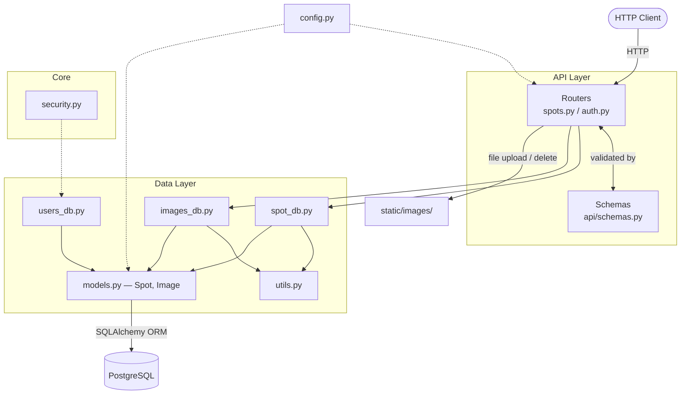
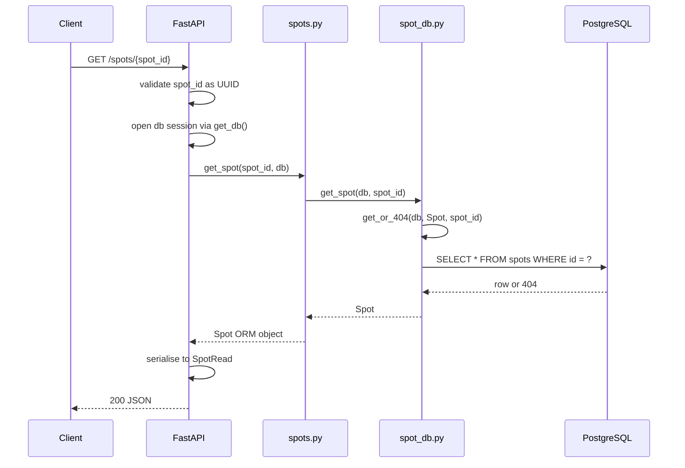
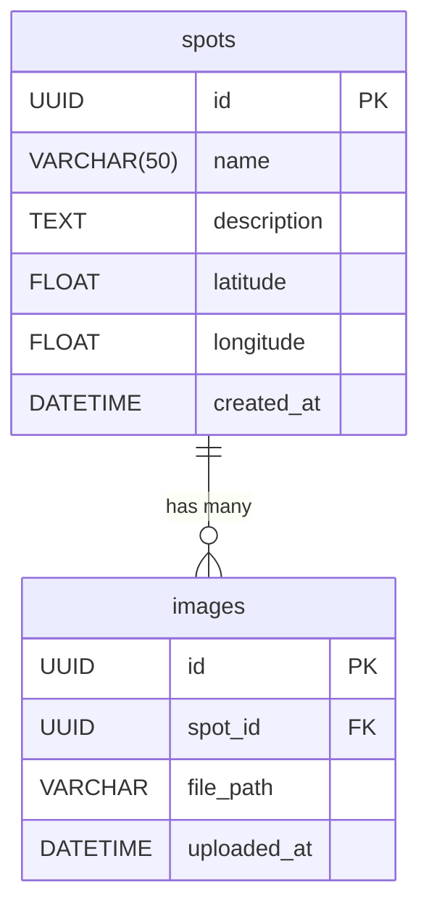

# Architecture

## Stack

| Layer | Technology |
|---|---|
| API framework | FastAPI |
| Data validation | Pydantic v2 |
| ORM | SQLAlchemy 2.x |
| Database | PostgreSQL |
| ASGI server | Uvicorn |
| Configuration | Pydantic Settings (reads from `.env`) |
| Testing | pytest + FastAPI TestClient |

---

## Project Structure

```
skatemap/
├── main.py              # Creates the FastAPI app and registers routers
├── run.py               # Dev runner — starts uvicorn and opens the browser
├── config.py            # Central config, reads from environment / .env
│
├── api/                 # HTTP layer
│   ├── schemas.py       # Pydantic request and response models
│   ├── spots.py         # /spots router and endpoint handlers
│   └── auth.py          # /auth router (stub — not yet implemented)
│
├── core/                # Shared application utilities
│   └── security.py      # Password hashing and JWT utilities (stub — not yet implemented)
│
├── database/            # Data access layer
│   ├── db.py            # Engine, session factory, declarative Base, get_db dependency
│   ├── models.py        # SQLAlchemy ORM models (Spot, Image)
│   ├── utils.py         # Shared query helpers (get_or_404)
│   ├── spot_db.py       # Spot CRUD operations
│   ├── images_db.py     # Image CRUD operations
│   └── users_db.py      # User operations (stub — not yet implemented)
│
├── static/images/       # Uploaded spot images, organised by spot UUID
│
└── tests/
    ├── conftest.py      # Shared fixtures — test DB, client, spot
    ├── test_api/        # Tests against the HTTP layer via TestClient
    └── test_db/         # Tests against the database layer directly
```

---

## Layer Diagram



---

## Request Lifecycle

Example — `GET /spots/{id}`:



---

## Data Model



Deleting a spot cascades to its images (`cascade="all, delete-orphan"`).

---

## Database Session

`get_db()` in `database/db.py` is a FastAPI dependency injected into route handlers. It opens a session before the handler runs and closes it once the response is sent.

In tests, `app.dependency_overrides[get_db]` replaces this with a session bound to the test database, keeping test data completely isolated from development data.

---

## Configuration

All settings are defined in `config.py` as a Pydantic `Settings` class. Values are read from environment variables, falling back to the defaults defined in the class. A `.env` file at the project root is loaded automatically.

`DATABASE_URL` is a computed property assembled from the individual `POSTGRES_*` fields. `BASE_DIR` and `UPLOAD_DIR` are `ClassVar` path constants, excluded from Pydantic's field handling.

---

## Image Storage

Uploaded images are saved to `static/images/{spot_id}/{filename}` on the local filesystem. The path is stored in the `images` table. Deleting an image via the API removes both the database record and the file from disk.
